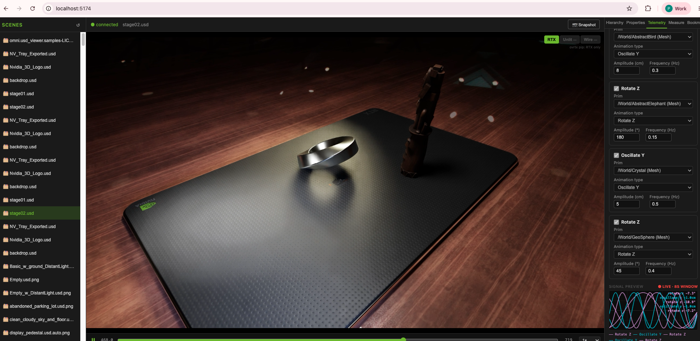

# Omniverse Realtime Viewer

A browser-based USD scene viewer powered by NVIDIA Omniverse's `ovrtx` renderer and `ovstream` WebRTC streaming library. Renders USD stages at full RTX quality on the server GPU and streams them live to the browser — no client-side GPU or Omniverse install required.



[▶ Demo video](https://github.com/pr9868/omniverse-realtime-viewer/releases) — see Releases for the full demo video

---

## Features

- **WebRTC streaming** — GPU-rendered frames delivered to the browser with sub-100 ms latency via `ovstream`
- **Render modes** — RTX path tracing, Unlit, and Wireframe; switchable at runtime
- **Scene browser** — lists USD files from a configured asset root; loads on demand
- **Prim hierarchy tree** — lazy-loaded USD prim tree with click-to-expand
- **GPU picking** — click anywhere in the viewport to select the underlying USD prim
- **Prim inspector** — read type, world transform, visibility, variant sets, and custom attributes
- **Transform editing** — write translate/rotate/scale back to the USD stage (live reload)
- **Session layer authoring** — create new primitives (Sphere, Cube, Cylinder, Xform, DomeLight), deactivate prims, undo/redo
- **Telemetry simulation** — bind prims to motion channels (oscillate XYZ, rotate Z, alert pulse, conveyor belt) and play back live animation on the stage
- **Camera bookmarks** — save and recall named camera positions
- **Timeline controls** — play, pause, scrub animated USD stages
- **Snapshot** — download the current frame as a PNG
- **REST API** — every capability is accessible over HTTP; use any client or script

---

## Architecture

```
┌─────────────────────────────────────────────────────────────┐
│                     SERVER (Python)                         │
│                                                             │
│  ovrtx.Renderer ──step()──▶ LdrColor RGBA8 frame           │
│       │                          │                         │
│       │           Warp kernel: RGBA → BGRA (GPU, no CPU)   │
│       │                          │                         │
│  scene_loader ◀── REST API       ▼                         │
│  (session layer,  /api/*    ovstream.Server                 │
│   telemetry USDA)           WebRTC stream + data channel   │
└─────────────────────────────────────────────────────────────┘
                         ▲              │
                    REST │              │ WebRTC (frames + events)
                         │              ▼
┌─────────────────────────────────────────────────────────────┐
│                  BROWSER (React / TypeScript)               │
│                                                             │
│  AppStreamer (WebRTC)   ←─── ovstream client JS            │
│  Viewport (canvas)                                          │
│  SceneList / HierarchyTree / Inspector / Telemetry / ...   │
└─────────────────────────────────────────────────────────────┘
```

The Python server is the sole renderer and owner of the USD stage. The browser is a pure UI — it sends commands (load scene, pick pixel, edit prim) via the REST API and receives rendered frames + server events via WebRTC.

---

## Requirements

| Requirement | Notes |
|---|---|
| NVIDIA GPU | RTX series recommended for path tracing; any CUDA-capable GPU works for Unlit/Wireframe |
| NVIDIA Omniverse ovrtx | Install from NVIDIA PyPI (`https://pypi.nvidia.com`) — requires an NGC API key |
| ovstream | Install from NVIDIA PyPI |
| NGC API key | Required for NVIDIA package downloads. Get one free at [build.nvidia.com](https://build.nvidia.com/) |
| Python 3.10+ | Server runtime |
| Node.js 18+, npm | Frontend build |
| Xvfb | Headless display server (Linux); usually pre-installed on GPU instances |
| Ubuntu 22.04 | Tested platform; other Linux distros should work |

---

## Setup

### 1. Backend

```bash
bash scripts/setup.sh
```

This creates a Python virtualenv at `.venv`, installs `ovrtx`, `ovstream`, `warp-lang`, `numpy`, and `aiohttp`, and verifies all imports.

### 2. Frontend

```bash
cd frontend-react
cp .env.example .env.local
# Edit .env.local and set your NGC API key:
#   NGC_API_KEY=nvapi-your-key-here
npm install
npm run build
```

The built frontend lands in `frontend-react/dist/` and is served by the Python server automatically.

### 3. Run

```bash
# From the project root:
bash scripts/run.sh

# Or with a specific stage:
bash scripts/run.sh --stage path/to/scene.usd

# Visit:
open http://localhost:8081
```

For remote servers, set your server's public IP so the WebRTC ICE candidates work:

```bash
PUBLIC_IP=<your-server-public-ip> bash scripts/run.sh
```

---

## Configuration

| Variable / Flag | Default | Description |
|---|---|---|
| `PUBLIC_IP` (env) | `""` (loopback) | Server's public IP for WebRTC ICE candidates. Set this for any non-localhost deployment. |
| `--width` | 1920 | Render resolution width (pixels) |
| `--height` | 1080 | Render resolution height (pixels) |
| `--fps` | 30 | Target frame rate |
| `--port` | 49100 | WebRTC signaling port |
| `--media-port` | 47998 | WebRTC media port |
| `--health-port` | 8081 | HTTP API and frontend port |
| `--stage` | (none) | USD stage to load on startup |
| `--asset-root` | `assets/samples` | Directory scanned for available USD files |

---

## REST API

All endpoints are served from the same port as the frontend (`--health-port`, default 8081).

| Method | Path | Description |
|---|---|---|
| GET | `/healthz` | 503 until first frame ready, then 200 |
| GET | `/api/status` | Scene state, prim count, camera angles |
| GET | `/api/scenes` | List of available USD files |
| POST | `/api/scene` | Load a USD scene `{ "path": "..." }` |
| GET | `/api/hierarchy?path=` | USD prim children at path |
| POST | `/api/pick` | Pixel → prim path `{ "x": N, "y": N }` |
| GET | `/api/prim?path=` | Prim type, xform, visibility, attrs |
| POST | `/api/prim/xform` | Write prim transform |
| POST | `/api/prim/visibility` | Toggle prim visibility |
| POST | `/api/prim/variant` | Select a variant |
| GET | `/api/prim/variants?path=` | List variant sets |
| GET | `/api/prim/bbox?path=` | World-space bounding box |
| POST | `/api/measure` | Distance between two prim centers |
| GET | `/api/search?q=` | Search prims by name/type |
| GET | `/api/timeline` | Animation timeline state |
| POST | `/api/timeline` | Control playback |
| GET | `/api/render/mode` | Current render mode |
| POST | `/api/render/mode` | Set render mode (rtx/unlit/wireframe) |
| POST | `/api/create_prim` | Create a prim in the session layer |
| POST | `/api/deactivate_prim` | Deactivate a prim |
| POST | `/api/undo` | Undo last session layer edit |
| POST | `/api/redo` | Redo last undone edit |
| POST | `/api/save` | Export stage to file |
| GET | `/api/snapshot` | Download current frame as PNG |
| GET | `/api/telemetry/prims` | Discover Xformable prims |
| POST | `/api/telemetry/generate` | Bake and play telemetry animation |
| POST | `/api/telemetry/stop` | Stop telemetry and reload original |
| GET | `/api/bookmarks` | List saved camera bookmarks |
| POST | `/api/bookmarks` | Save current camera as bookmark |
| POST | `/api/bookmarks/recall/{name}` | Recall a bookmark |
| DELETE | `/api/bookmarks/{name}` | Delete a bookmark |

---

## Project Structure

```
omniverse-realtime-viewer/
├── server/                     # Python server
│   ├── __main__.py             # Entry point + HTTP handler
│   ├── config.py               # Events, ServerConfig
│   ├── ov_web_viewer_server.py # Server logic, camera, bookmarks
│   ├── renderer_runtime.py     # ovrtx renderer wrapper (render-thread-only)
│   ├── scene_loader.py         # USD stage loading, session layer, telemetry
│   ├── stream_server.py        # ovstream WebRTC wrapper
│   └── frame_converter.py      # CUDA RGBA→BGRA kernel (Warp)
├── frontend-react/             # React/TypeScript frontend
│   ├── src/
│   │   ├── App.tsx             # Root layout, shared state
│   │   ├── api/client.ts       # REST API client
│   │   ├── types/index.ts      # TypeScript interfaces
│   │   └── components/
│   │       ├── Viewport.tsx    # WebRTC canvas + mouse camera nav
│   │       ├── SceneList.tsx   # Scene browser
│   │       ├── HierarchyTree.tsx  # USD prim tree
│   │       ├── Inspector.tsx   # Prim inspector panel
│   │       ├── Properties.tsx  # Prim transform editor
│   │       ├── RenderModeToolbar.tsx
│   │       ├── TimelineBar.tsx
│   │       └── Telemetry.tsx   # Telemetry simulation panel
│   ├── index.html
│   ├── package.json
│   ├── vite.config.ts
│   └── tsconfig.json
├── scripts/
│   ├── setup.sh                # venv + dependency install
│   └── run.sh                  # Start server (Xvfb + Python)
├── docs/
│   ├── demo-screenshot.png
│   └── demo.mov
├── requirements.txt
├── .env.example
└── .gitignore
```

---

## License

Apache 2.0 — see [LICENSE](LICENSE) or the `SPDX-License-Identifier: Apache-2.0` header in each source file.
